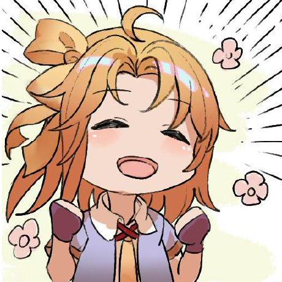

# GameMaker Mass Mod Patcher (GM3P)

**G**ame**M**aker **M**ass **M**od **P**atcher (abbreviated to **GM3P**) is a tool used to merge multiple xdelta mods for GameMaker games and thus be able to play multiple mods at once. 

_This tool is currently used in the backend of [Deltamod](https://gamebanana.com/tools/20575) for mod merging._

## How to build
1. Make sure you have .NET 8.0 or later and Git installed 
2. Open the .sln up in VS or Jetbrains and build the project "GM3P". (IDK about other IDEs like VSCode) 
3. Open the .sln up of [UTMT-For-GM3P](https://github.com/deltamodders/UTMT-For-GM3P) and build the project "UnderTaleModCli" 
4. Copy and paste the UTMT build into the GM3P build under a folder named "UTMTCLI"  
5. Copy and paste the contents of the "UTMT Scripts" folder under a folder named "Scripts" under "UTMTCLI"  
6. Download [xDelta3 v3.0.11 64-bit](https://github.com/jmacd/xdelta-gpl/releases/download/v3.0.11/xdelta3-3.0.11-x86_64.exe.zip) and paste it under the GM3P build.
7. Happy patching

## Credits
| | Name | Role |
|-|------|-------|
|  | **[Zorkats](https://gamebanana.com/members/3914910)** | Main programmer |
|  | **[techy804](https://gamebanana.com/members/4548254)** | Creator of GM3P |

## License
Licensed under GNU GPL 3.0
